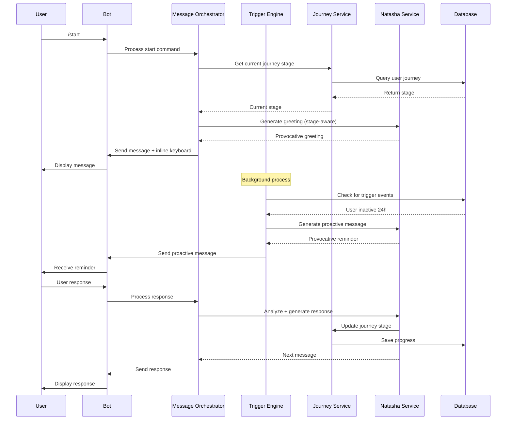

# Design Document

## Overview

Данный документ описывает архитектуру и дизайн системы проактивного взаимодействия бота reLove с пользователями. Система обеспечивает автоматическое ведение пользователя по сценариям Наташи и пути героя Кэмпбелла через проактивные сообщения, минималистичный интерфейс в стиле relove.ru и адаптивные провокации.

## Architecture

### High-Level Architecture

```
┌─────────────────────────────────────────────────────────────┐
│                    Telegram Bot API                          │
└────────────────────┬────────────────────────────────────────┘
                     │
┌────────────────────▼────────────────────────────────────────┐
│              Proactive Bot Interface Layer                   │
│  ┌──────────────┐  ┌──────────────┐  ┌──────────────┐      │
│  │ Message      │  │ Trigger      │  │ UI/UX        │      │
│  │ Orchestrator │  │ Engine       │  │ Manager      │      │
│  └──────────────┘  └──────────────┘  └──────────────┘      │
└────────────────────┬────────────────────────────────────────┘
                     │
┌────────────────────▼────────────────────────────────────────┐
│                  Core Services Layer                         │
│  ┌──────────────┐  ┌──────────────┐  ┌──────────────┐      │
│  │ Journey      │  │ Natasha      │  │ Profile      │      │
│  │ Service      │  │ Service      │  │ Service      │      │
│  └──────────────┘  └──────────────┘  └──────────────┘      │
└────────────────────┬────────────────────────────────────────┘
                     │
┌────────────────────▼────────────────────────────────────────┐
│                    Data Layer                                │
│  ┌──────────────┐  ┌──────────────┐  ┌──────────────┐      │
│  │ PostgreSQL   │  │ Redis        │  │ Background   │      │
│  │ Database     │  │ Cache        │  │ Tasks        │      │
│  └──────────────┘  └──────────────┘  └──────────────┘      │
└─────────────────────────────────────────────────────────────┘
```


### Component Interaction Flow



## Components and Interfaces

### 1. Message Orchestrator

**Responsibility:** Координирует все сообщения бота, управляет потоком диалога

**Interface:**
```python
class MessageOrchestrator:
    async def process_user_message(
        self,
        user_id: int,
        message: str,
        context: SessionContext
    ) -> BotResponse
    
    async def generate_proactive_message(
        self,
        user_id: int,
        trigger_type: TriggerType
    ) -> Optional[BotResponse]
    
    async def format_message_with_ui(
        self,
        message: str,
        stage: JourneyStageEnum,
        ui_type: UIType
    ) -> FormattedMessage
```


**Key Methods:**
- `process_user_message()`: Обрабатывает входящее сообщение пользователя
- `generate_proactive_message()`: Генерирует проактивное сообщение по триггеру
- `format_message_with_ui()`: Форматирует сообщение с UI элементами

### 2. Trigger Engine

**Responsibility:** Отслеживает события и запускает проактивные сообщения

**Interface:**
```python
class TriggerEngine:
    async def check_inactivity_triggers(self) -> List[ProactiveTrigger]
    
    async def check_milestone_triggers(self) -> List[ProactiveTrigger]
    
    async def check_pattern_triggers(
        self,
        user_id: int,
        conversation: List[Message]
    ) -> Optional[ProactiveTrigger]
    
    async def schedule_proactive_message(
        self,
        user_id: int,
        trigger: ProactiveTrigger,
        delay: timedelta
    )
```

**Trigger Types:**
- `INACTIVITY_24H`: Пользователь не отвечал 24 часа
- `MILESTONE_COMPLETED`: Завершён важный этап
- `PATTERN_DETECTED`: Обнаружен паттерн избегания
- `MORNING_CHECK`: Утреннее сообщение (8:00-10:00)
- `STAGE_TRANSITION`: Переход на новый этап пути

### 3. UI/UX Manager

**Responsibility:** Управляет визуальным представлением и интерфейсом

**Interface:**
```python
class UIManager:
    def create_inline_keyboard(
        self,
        buttons: List[ButtonConfig],
        style: KeyboardStyle = KeyboardStyle.RELOVE
    ) -> InlineKeyboardMarkup
    
    def create_quick_replies(
        self,
        stage: JourneyStageEnum,
        context: Dict
    ) -> InlineKeyboardMarkup
    
    def format_progress_indicator(
        self,
        current_stage: JourneyStageEnum,
        completed_stages: List[JourneyStageEnum]
    ) -> str
    
    def apply_relove_styling(
        self,
        text: str,
        emphasis: List[str] = []
    ) -> str
```

**Design System (relove.ru style):**
- Минимализм: короткие абзацы, пустые строки
- Эмоциональность: эмодзи для усиления провокаций
- Провокация: жирный текст для ключевых фраз
- Цветовая схема: эмодзи вместо цветов (✅🔥⚪️)


### 4. Journey Service (Enhanced)

**Responsibility:** Отслеживает путь героя и адаптирует стиль общения

**Interface:**
```python
class JourneyTrackingService:
    async def analyze_and_update_stage(
        self,
        user_id: int,
        conversation: List[Message]
    ) -> JourneyStageEnum
    
    async def get_stage_specific_prompts(
        self,
        stage: JourneyStageEnum
    ) -> StagePrompts
    
    async def calculate_stage_progress(
        self,
        user_id: int
    ) -> float  # 0.0 - 1.0
    
    async def get_next_stage_requirements(
        self,
        current_stage: JourneyStageEnum
    ) -> List[str]
```

**Stage-Specific Behavior:**
```python
STAGE_BEHAVIORS = {
    JourneyStageEnum.REFUSAL: {
        "provocation_level": "soft",
        "techniques": ["gentle_questioning", "reframing"],
        "quick_replies": ["Боюсь", "Не готов(а)", "Расскажи больше"]
    },
    JourneyStageEnum.MEETING_MENTOR: {
        "provocation_level": "directive",
        "techniques": ["direct_instruction", "boundary_setting"],
        "quick_replies": ["Готов(а) действовать", "Что делать?", "Дай инструкцию"]
    },
    JourneyStageEnum.TRIALS: {
        "provocation_level": "hard",
        "techniques": ["somatic_shock", "death_acceptance"],
        "quick_replies": ["Готов(а) принять 💀", "Боюсь 😰", "Продолжай"]
    }
}
```

### 5. Natasha Service (Enhanced)

**Responsibility:** Генерирует провокативные сообщения в стиле Наташи

**Interface:**
```python
class NatashaProactiveService:
    async def generate_stage_aware_response(
        self,
        user_message: str,
        stage: JourneyStageEnum,
        context: SessionContext
    ) -> str
    
    async def generate_proactive_reminder(
        self,
        user_id: int,
        last_message: str,
        hours_inactive: int
    ) -> str
    
    async def generate_milestone_message(
        self,
        stage_completed: JourneyStageEnum,
        next_stage: JourneyStageEnum
    ) -> str
    
    async def detect_avoidance_pattern(
        self,
        conversation: List[Message]
    ) -> Optional[AvoidancePattern]
```


### 6. Profile Service (Enhanced)

**Responsibility:** Управляет профилями пользователей и персонализацией

**Interface:**
```python
class ProfileService:
    async def get_user_context(
        self,
        user_id: int
    ) -> UserContext
    
    async def update_natasha_profile(
        self,
        user_id: int,
        insights: List[str],
        patterns: List[str]
    )
    
    async def get_stream_recommendations(
        self,
        user_id: int,
        max_recommendations: int = 2
    ) -> List[StreamRecommendation]
    
    async def track_interaction(
        self,
        user_id: int,
        interaction_type: InteractionType,
        metadata: Dict
    )
```

## Data Models

### ProactiveTrigger

```python
class ProactiveTrigger(Base):
    __tablename__ = "proactive_triggers"
    
    id: int
    user_id: int
    trigger_type: TriggerTypeEnum
    scheduled_time: datetime
    executed: bool
    message_sent: Optional[str]
    user_response: Optional[str]
    created_at: datetime
```

### UserInteraction

```python
class UserInteraction(Base):
    __tablename__ = "user_interactions"
    
    id: int
    user_id: int
    interaction_type: InteractionTypeEnum  # message, button_click, quick_reply
    content: str
    journey_stage: JourneyStageEnum
    timestamp: datetime
    metadata: Dict  # JSON field
```

### ProactivityConfig

```python
class ProactivityConfig(Base):
    __tablename__ = "proactivity_config"
    
    id: int
    max_messages_per_day: int = 2
    time_window_start: time = time(8, 0)
    time_window_end: time = time(22, 0)
    enabled_triggers: List[str]  # JSON array
    updated_at: datetime
```


## Error Handling

### Error Categories

1. **User Input Errors**
   - Invalid button callback
   - Unexpected message format
   - Action: Log, send friendly error message, continue session

2. **LLM Service Errors**
   - API timeout
   - Rate limit exceeded
   - Action: Retry with exponential backoff, fallback to template responses

3. **Database Errors**
   - Connection lost
   - Transaction failed
   - Action: Retry, queue for later processing, notify admin

4. **Trigger Engine Errors**
   - Scheduling conflict
   - Too many messages
   - Action: Skip trigger, log, adjust schedule

### Error Recovery Strategy

```python
class ErrorHandler:
    async def handle_llm_error(
        self,
        error: Exception,
        context: Dict
    ) -> str:
        """Returns fallback response"""
        if isinstance(error, TimeoutError):
            return await self.get_template_response(context)
        elif isinstance(error, RateLimitError):
            await self.schedule_retry(context, delay=60)
            return "Дай мне минуту..."
        else:
            logger.error(f"LLM error: {error}")
            return "..."
    
    async def handle_trigger_error(
        self,
        trigger: ProactiveTrigger,
        error: Exception
    ):
        """Handles trigger execution errors"""
        trigger.executed = False
        trigger.error_message = str(error)
        await self.reschedule_trigger(trigger, delay=timedelta(hours=1))
```

## Testing Strategy

### Unit Tests

1. **Message Orchestrator Tests**
   - Test message routing logic
   - Test UI formatting
   - Test context management

2. **Trigger Engine Tests**
   - Test trigger detection logic
   - Test scheduling algorithm
   - Test rate limiting

3. **UI Manager Tests**
   - Test keyboard generation
   - Test progress indicator formatting
   - Test styling application


### Integration Tests

1. **End-to-End Flow Tests**
   - Test complete user journey from /start to stream selection
   - Test proactive message delivery
   - Test session pause and resume

2. **Trigger Integration Tests**
   - Test inactivity trigger → message delivery
   - Test milestone trigger → congratulations message
   - Test pattern detection → proactive intervention

3. **Database Integration Tests**
   - Test session persistence
   - Test trigger scheduling
   - Test interaction tracking

### Manual Testing Scenarios

1. **Proactive Behavior**
   - Scenario: User starts session, doesn't respond for 24h
   - Expected: Receive proactive reminder with provocative question
   - Verify: Message tone matches journey stage

2. **UI/UX Flow**
   - Scenario: User clicks quick reply button
   - Expected: Bot processes as text message, continues naturally
   - Verify: No UI glitches, smooth transition

3. **Stage Adaptation**
   - Scenario: User progresses from "Refusal" to "Meeting Mentor"
   - Expected: Bot style changes from soft to directive
   - Verify: Provocation level increases appropriately

## Performance Considerations

### Optimization Strategies

1. **Message Generation**
   - Cache common responses by stage
   - Use streaming for long LLM responses
   - Batch process multiple users' triggers

2. **Database Queries**
   - Index on user_id, journey_stage, timestamp
   - Use Redis for session state caching
   - Implement connection pooling

3. **Background Tasks**
   - Use Celery for trigger processing
   - Implement task prioritization
   - Set max concurrent tasks limit

### Scalability

```python
# Redis caching for session state
class SessionCache:
    async def get_session(self, user_id: int) -> Optional[SessionContext]:
        key = f"session:{user_id}"
        data = await redis.get(key)
        return SessionContext.parse_raw(data) if data else None
    
    async def set_session(
        self,
        user_id: int,
        session: SessionContext,
        ttl: int = 3600
    ):
        key = f"session:{user_id}"
        await redis.setex(key, ttl, session.json())
```


## Security Considerations

### Data Privacy

1. **User Data Protection**
   - Encrypt sensitive profile data at rest
   - Use secure connections (TLS) for all API calls
   - Implement data retention policies

2. **Access Control**
   - Admin-only access to proactivity config
   - User can pause/resume proactive messages
   - User can delete their data

### Rate Limiting

```python
class RateLimiter:
    async def check_proactive_limit(
        self,
        user_id: int,
        date: datetime.date
    ) -> bool:
        """Check if user hasn't exceeded daily proactive message limit"""
        key = f"proactive_count:{user_id}:{date}"
        count = await redis.get(key) or 0
        config = await self.get_config()
        return int(count) < config.max_messages_per_day
    
    async def increment_proactive_count(
        self,
        user_id: int,
        date: datetime.date
    ):
        key = f"proactive_count:{user_id}:{date}"
        await redis.incr(key)
        await redis.expire(key, 86400)  # 24 hours
```

## Monitoring and Logging

### Metrics to Track

1. **User Engagement**
   - Proactive message open rate
   - Quick reply usage rate
   - Session completion rate
   - Average session duration

2. **System Performance**
   - LLM response time
   - Trigger execution latency
   - Database query time
   - Error rate by component

3. **Business Metrics**
   - Users progressing through journey stages
   - Stream recommendation acceptance rate
   - User retention rate

### Logging Strategy

```python
import structlog

logger = structlog.get_logger()

# Example log entries
logger.info(
    "proactive_message_sent",
    user_id=user_id,
    trigger_type=trigger.type,
    journey_stage=stage.value,
    message_length=len(message)
)

logger.warning(
    "proactive_limit_reached",
    user_id=user_id,
    date=date.today(),
    limit=config.max_messages_per_day
)

logger.error(
    "llm_generation_failed",
    user_id=user_id,
    error=str(error),
    retry_count=retry_count
)
```


## Configuration Management

### Environment Variables

```bash
# Proactivity settings
PROACTIVE_ENABLED=true
PROACTIVE_MAX_MESSAGES_PER_DAY=2
PROACTIVE_TIME_WINDOW_START=08:00
PROACTIVE_TIME_WINDOW_END=22:00

# Trigger settings
INACTIVITY_TRIGGER_HOURS=24
MORNING_CHECK_TIME=09:00
PATTERN_DETECTION_THRESHOLD=3

# UI settings
RELOVE_DESIGN_MODE=minimal
EMOJI_ENABLED=true
QUICK_REPLIES_MAX=3
```

### Admin Configuration Interface

```python
class ProactivityConfigService:
    async def update_config(
        self,
        admin_id: int,
        updates: Dict[str, Any]
    ) -> ProactivityConfig:
        """Update proactivity configuration"""
        config = await self.get_config()
        
        for key, value in updates.items():
            if hasattr(config, key):
                setattr(config, key, value)
        
        await self.session.commit()
        
        # Invalidate cache
        await redis.delete("proactivity_config")
        
        logger.info(
            "proactivity_config_updated",
            admin_id=admin_id,
            updates=updates
        )
        
        return config
    
    async def toggle_trigger_type(
        self,
        trigger_type: TriggerTypeEnum,
        enabled: bool
    ):
        """Enable/disable specific trigger type"""
        config = await self.get_config()
        
        if enabled and trigger_type not in config.enabled_triggers:
            config.enabled_triggers.append(trigger_type.value)
        elif not enabled and trigger_type in config.enabled_triggers:
            config.enabled_triggers.remove(trigger_type.value)
        
        await self.session.commit()
```

## Migration Strategy

### Phase 1: Foundation (Week 1-2)
- Implement Message Orchestrator
- Implement UI Manager with relove.ru styling
- Create basic inline keyboards

### Phase 2: Proactivity (Week 3-4)
- Implement Trigger Engine
- Add background task processing
- Implement rate limiting

### Phase 3: Intelligence (Week 5-6)
- Enhance Journey Service with stage detection
- Enhance Natasha Service with stage-aware responses
- Implement pattern detection

### Phase 4: Polish (Week 7-8)
- Add progress indicators
- Implement admin configuration
- Performance optimization
- Comprehensive testing


## Design Patterns

### 1. Strategy Pattern (Provocation Styles)

```python
class ProvocationStrategy(ABC):
    @abstractmethod
    async def generate_response(
        self,
        context: SessionContext
    ) -> str:
        pass

class SoftProvocationStrategy(ProvocationStrategy):
    """For Refusal stage"""
    async def generate_response(self, context):
        return await natasha_service.generate_with_techniques(
            context,
            techniques=["gentle_questioning", "reframing"]
        )

class HardProvocationStrategy(ProvocationStrategy):
    """For Trials stage"""
    async def generate_response(self, context):
        return await natasha_service.generate_with_techniques(
            context,
            techniques=["somatic_shock", "death_acceptance"]
        )

class ProvocationContext:
    def __init__(self, strategy: ProvocationStrategy):
        self.strategy = strategy
    
    async def execute(self, context: SessionContext) -> str:
        return await self.strategy.generate_response(context)
```

### 2. Observer Pattern (Trigger Events)

```python
class TriggerObserver(ABC):
    @abstractmethod
    async def on_trigger(self, event: TriggerEvent):
        pass

class ProactiveMessageObserver(TriggerObserver):
    async def on_trigger(self, event: TriggerEvent):
        message = await message_orchestrator.generate_proactive_message(
            event.user_id,
            event.trigger_type
        )
        await bot.send_message(event.user_id, message)

class AnalyticsObserver(TriggerObserver):
    async def on_trigger(self, event: TriggerEvent):
        await analytics.track_trigger_fired(
            event.user_id,
            event.trigger_type
        )

class TriggerSubject:
    def __init__(self):
        self.observers: List[TriggerObserver] = []
    
    def attach(self, observer: TriggerObserver):
        self.observers.append(observer)
    
    async def notify(self, event: TriggerEvent):
        for observer in self.observers:
            await observer.on_trigger(event)
```

### 3. Builder Pattern (Message Construction)

```python
class MessageBuilder:
    def __init__(self):
        self.text = ""
        self.keyboard = None
        self.parse_mode = "Markdown"
        self.styling = []
    
    def with_text(self, text: str) -> 'MessageBuilder':
        self.text = text
        return self
    
    def with_quick_replies(
        self,
        stage: JourneyStageEnum
    ) -> 'MessageBuilder':
        self.keyboard = ui_manager.create_quick_replies(stage)
        return self
    
    def with_relove_styling(self) -> 'MessageBuilder':
        self.text = ui_manager.apply_relove_styling(self.text)
        return self
    
    def with_progress_indicator(
        self,
        current_stage: JourneyStageEnum,
        completed: List[JourneyStageEnum]
    ) -> 'MessageBuilder':
        indicator = ui_manager.format_progress_indicator(
            current_stage,
            completed
        )
        self.text = f"{indicator}\n\n{self.text}"
        return self
    
    def build(self) -> FormattedMessage:
        return FormattedMessage(
            text=self.text,
            keyboard=self.keyboard,
            parse_mode=self.parse_mode
        )

# Usage
message = (MessageBuilder()
    .with_text("Вижу твою готовность.")
    .with_relove_styling()
    .with_quick_replies(JourneyStageEnum.MEETING_MENTOR)
    .with_progress_indicator(current_stage, completed_stages)
    .build())
```

## API Endpoints (for Dashboard)

### Proactivity Management

```python
@router.get("/api/proactivity/config")
async def get_proactivity_config(
    admin: Admin = Depends(get_current_admin)
) -> ProactivityConfig:
    """Get current proactivity configuration"""
    return await config_service.get_config()

@router.put("/api/proactivity/config")
async def update_proactivity_config(
    updates: Dict[str, Any],
    admin: Admin = Depends(get_current_admin)
) -> ProactivityConfig:
    """Update proactivity configuration"""
    return await config_service.update_config(admin.id, updates)

@router.get("/api/proactivity/triggers")
async def get_scheduled_triggers(
    admin: Admin = Depends(get_current_admin)
) -> List[ProactiveTrigger]:
    """Get all scheduled proactive triggers"""
    return await trigger_engine.get_scheduled_triggers()

@router.post("/api/proactivity/triggers/{trigger_id}/cancel")
async def cancel_trigger(
    trigger_id: int,
    admin: Admin = Depends(get_current_admin)
):
    """Cancel a scheduled trigger"""
    await trigger_engine.cancel_trigger(trigger_id)
    return {"status": "cancelled"}
```

### Analytics Endpoints

```python
@router.get("/api/analytics/engagement")
async def get_engagement_metrics(
    start_date: date,
    end_date: date,
    admin: Admin = Depends(get_current_admin)
) -> EngagementMetrics:
    """Get user engagement metrics"""
    return await analytics_service.get_engagement_metrics(
        start_date,
        end_date
    )

@router.get("/api/analytics/journey-progress")
async def get_journey_progress(
    admin: Admin = Depends(get_current_admin)
) -> Dict[str, int]:
    """Get distribution of users across journey stages"""
    return await analytics_service.get_journey_distribution()
```

